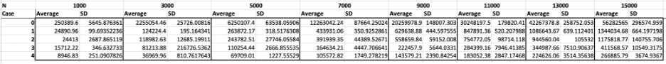
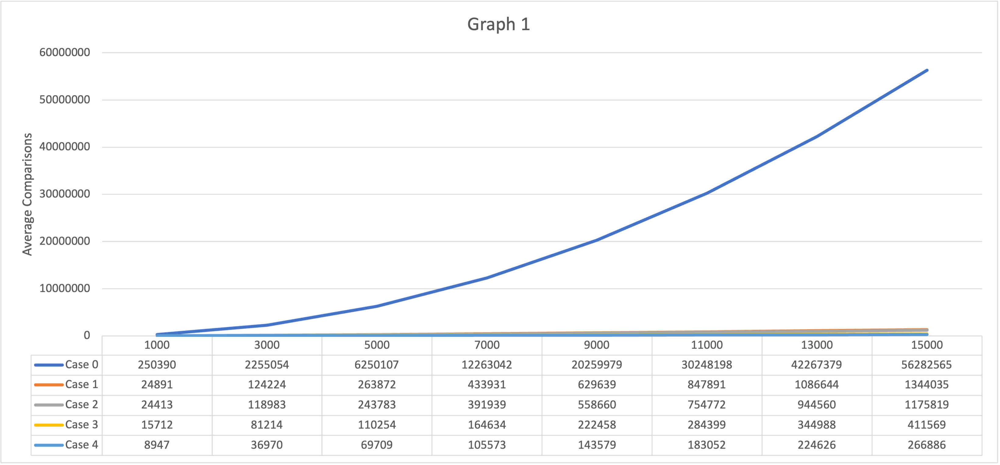
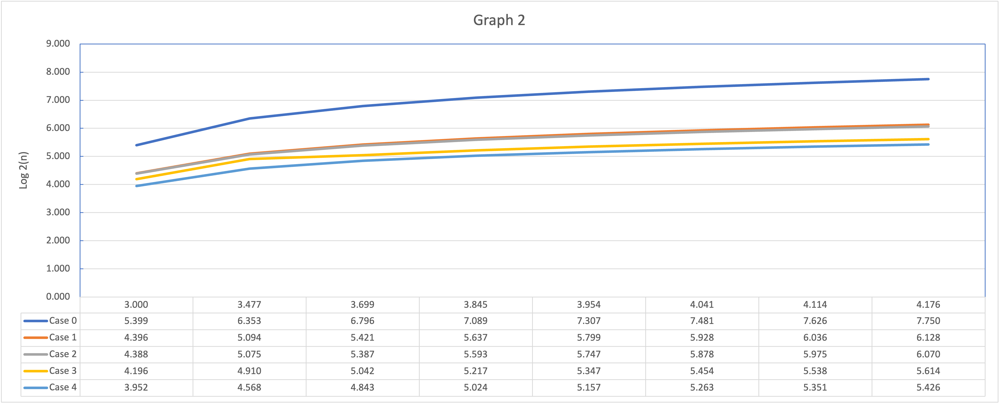

**Project 1 Analysis**

After careful analysis of Shell Sort by generating 100 different sets and taking the average as well as the standard deviation where n = 1000, 3000, 5000, 7000, 9000, 11000, 13000, and 15000, 

and with the following cases:

Cases:
Code: an integer denoting how the hlist array (as in the source code) is to be formed:

- 0: hlist should be [1] (i.e. essentially insertion sort)

- 1: hlist should be [k2, (k-1) 2, ..., 4, 1] where k is the maximum number such that k 2 is still (strictly) smaller than the number of objects to be sorted. (Notice that in this case 1 = 4*1 - 3)

- 2: hlist should be [2 k, 2 (k-1) , 2 (k-2) , ... 2, 1] where k is the maximum number such that 2 k is still (strictly) smaller than the number of objects to be sorted. (Notice that in this case 1 = 2 1 - 1)

- 3: hlist should be [2 k -1, 2(k-1) -1, 2(k-2) -1 ... 3, 1] where k is the maximum number such that 2 k – 1 is still (strictly) smaller than the number of objects to be sorted. (Notice that in this case 1 = 2 1 - 1)

- 4: hlist should be [4 k+1 + 3 * 2 k + 1, ... 8, 1 ], where k is the maximum number such that 4 k+1 + 3 * 2 k + 1 is still (strictly) smaller than the number of objects to be sorted. If there are 8 or fewer numbers in the array to be sorted, the list should be [1].

we can conclude with the following analysis.

### Following Graph Analysis

| N input| **1000** | **3000** | **5000** | **7000** | **9000** | **11000** | **13000** | **15000** |
|--------|----------|----------|----------|----------|----------|-----------|-----------|-----------|
| Case 0 | 993      | 2992     | 4991     | 6991     | 8991     | 10990     | 12990     | 14990     |
| Case 1 | 20578    | 108037   | 233197   | 386938   | 564696   | 763612    | 981626    | 1217246   |
| Case 2 | 7966     | 28892    | 51795    | 75795    | 100603   | 126601    | 152601    | 178601    |
| Case 3 | 7980     | 28910    | 51814    | 75813    | 100622   | 126622    | 152621    | 178622    |
| Case 4 | 5082     | 19733    | 36675    | 55098    | 73992    | 92554     | 113591    | 134729    |

|N input | **1000** | **3000** | **5000** | **7000** | **9000** | **11000** | **13000** | **15000** |
|--------|----------|----------|----------|----------|----------|-----------|-----------|-----------|
| Case 0 | 993      | 2992     | 4991     | 6991     | 8991     | 10990     | 12990     | 14990     |
| Case 1 | 20578    | 108037   | 233197   | 386938   | 564696   | 763612    | 981626    | 1217246   |
| Case 2 | 7966     | 28892    | 51795    | 75795    | 100603   | 126601    | 152601    | 178601    |
| Case 3 | 7980     | 28910    | 51814    | 75813    | 100622   | 126622    | 152621    | 178622    |
| Case 4 | 5082     | 19733    | 36675    | 55098    | 73992    | 92554     | 113591    | 134729    |

